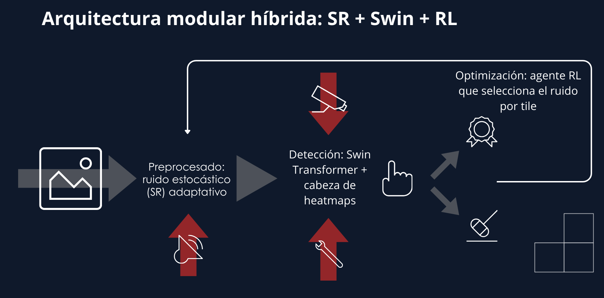

# Stochastic Resonance and Machine Learning Noise Reduction
## Overview

This repository contains a machine learning and signal processing framework for reducing noise in astronomical images using Stochastic Resonance (SR) and data-driven detection techniques. The project integrates image preprocessing, heatmap-based object detection, and evaluation pipelines to support experimental analysis and reproducibility.

The goal is to explore how noise injection and contrast enhancement can aid object detection models in low-signal data, particularly for scientific imaging where traditional denoising approaches may fail. This work was developed as part of an academic research project involving deep learning, signal processing, and astronomical datasets.

## Motivation

High noise levels in scientific imaging — such as deep-space telescope data — can obscure weak signals and make object detection challenging. Traditional denoising algorithms often smooth out important features, while data-driven methods can fail in low-signal regimes. Stochastic Resonance is a technique that deliberately injects controlled noise to enhance the detectability of subtle patterns. Combining SR with ML models offers a novel experimentation approach that may improve detection performance under specific constraints.

## Repository Structure
```
.
├── data/                          # Reference data (catalogs, FITS images)
├── output_visualizations/         # Generated output figures
├── runs/rl/                       # Logs and results from noise injection sweeps
├── src/                           # Source code and scripts
├── checkpoints/                   # Saved model weights (supervised only)
├── requirements.txt               # Python dependencies
├── README.md                      # This file
├── flags.txt                      # Marker or configuration file
└── detections.txt                 # Example detections output
```
## Data

The dataset used in this project comprises astronomical images and associated object catalogs (e.g., SExtractor `.cat` files). A curated benchmark catalog is included in `data/benchmark/`. This allows reproducing detection visualizations without requiring users to run external tools like SExtractor.

### Notes on Data Usage

- The repository includes reference catalogs; *no additional downloads are required* to visualize results.
- If you wish to rerun the full pipeline (including preprocessing), Linux or WSL environments are recommended.

## Methodology

### System Architecture



The system follows a modular hybrid design combining:
- Stochastic Resonance (SR) as a preprocessing stage for controlled noise injection,
- A Swin Transformer–based detection backbone with a heatmap prediction head,
- An optional reinforcement learning (RL) agent to adapt noise parameters at the tile level.

This modular design enables independent experimentation with preprocessing, detection, and optimization components.

This framework implements a combined approach:

1. **Stochastic Resonance (SR) Preprocessing**:
Controlled noise injection and contrast transformations designed to improve underlying signal detection.

2. **Machine Learning Models**:
A supervised detection model trained on labeled data to generate object heatmaps. The architecture, training pipeline, and evaluation code are contained in `src/`.

3. **Visualization**:
Scripts such as `src/insight.py` generate diagnostic visualizations including heatmaps and overlayed detections on input images.

## Results and Insights

### Qualitative Analysis


The figure shows an overlay of model predictions and SExtractor-based ground truth on a representative FITS image.
A high density of predicted detections is observed in regions where the ground truth catalog is incomplete or artificially truncated due to stacking artifacts.
Many apparent false positives correspond to visually plausible astronomical objects that are not labeled in the reference catalog.

To avoid penalizing valid detections in unreliable areas, evaluation masks were applied to ignore boundary regions affected by ground truth artifacts.
This reflects a deliberate methodological choice rather than a model failure.

This repository includes example visual outputs in `output_visualizations/`, illustrating model responses on benchmark images after SR and model inference. These visualizations are useful for qualitative analysis of detection performance under different preprocessing conditions.

Quantitative evaluation and performance metrics can be added by extending the evaluation scripts with standard metrics such as precision, recall, and F1 score on held-out datasets.

## Requirements

All dependencies are listed in `requirements.txt`. To install them:

```bash
pip install -r requirements.txt
```

### How to Run

**1. Environment Preparation**

It is recommended to use a Python virtual environment:
```
python3 -m venv venv
source venv/bin/activate
pip install -r requirements.txt
```
**2. Visualize Model Outputs**

Run the visualization script:
``` bash
python src/insight.py
```

This generates heatmaps and overlaid detection plots in the `output_visualizations/` directory.

**3. Reproduce Preprocessing (Optional)**

If you wish to rerun the entire pipeline using raw image data and control SR parameters, use the scripts in `src/` and adjust the configuration arguments according to your experimentation needs.

## Limitations and Future Work

Current visualization and detection code focuses on qualitative analysis; integrating standardized quantitative evaluation would strengthen performance claims.

The noise injection strategy can be extended to include parameter sweeps and automated selection of optimal SR settings.

Adapting the framework to support more image modalities and datasets (beyond astronomy) could broaden applicability.

## Tech Stack
- Python
- NumPy, SciPy
- Torch
- Visualization libraries (Matplotlib, Seaborn)
- Domain-specific tools for astronomical data handling
